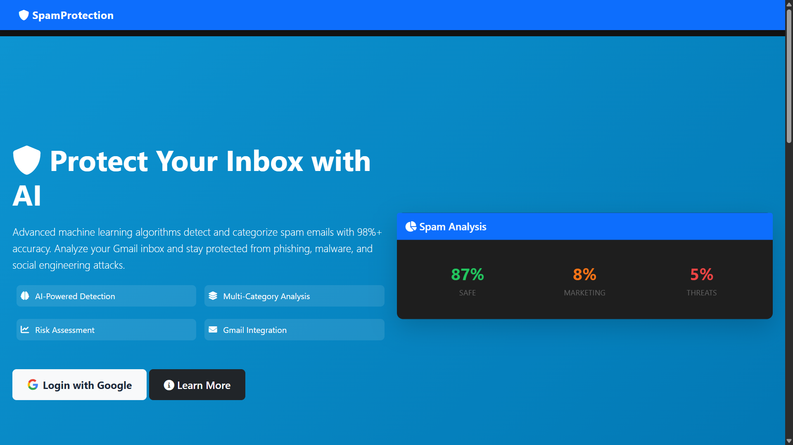
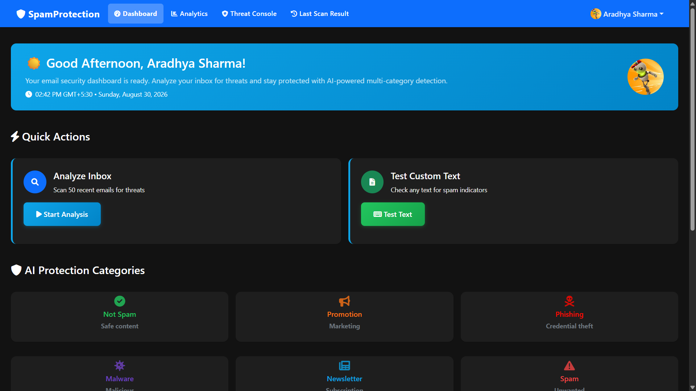
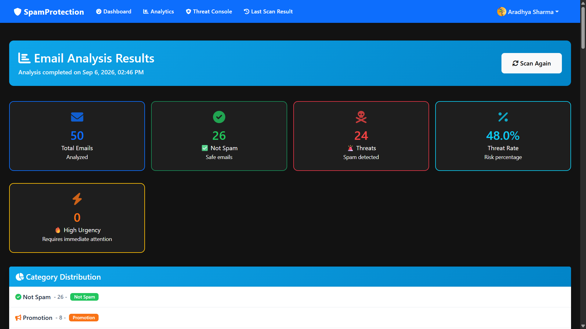
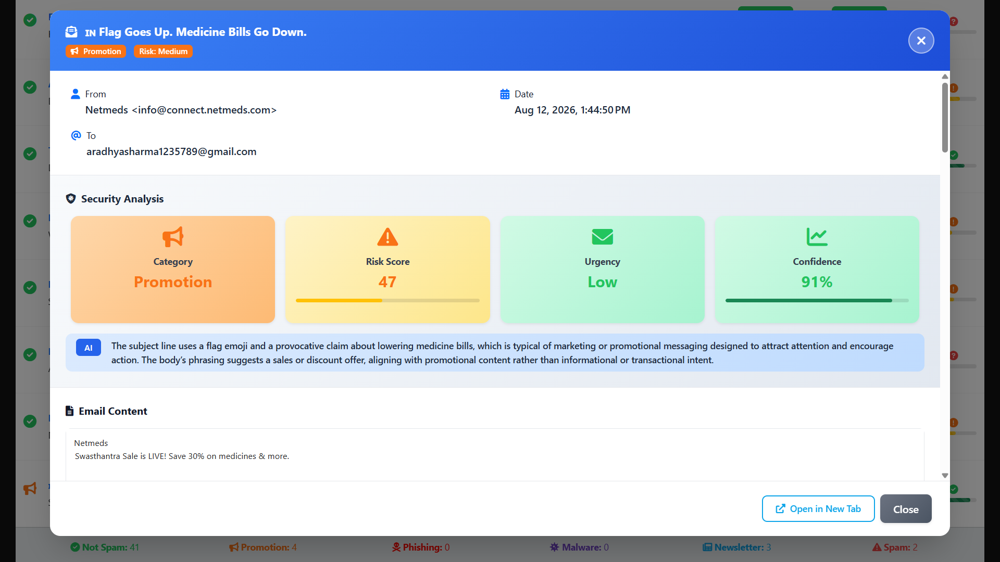

# AI-Powered Email Spam Detection and Threat Analysis


A local-first web app that reads your Gmail (read-only), classifies each
message into one of six categories with a fine-tuned RoBERTa + sklearn
ensemble, and explains every verdict with a risk breakdown, urgency score,
sender reputation, and an AI-written summary. Built as a 7th-semester major
project by **Abhishek Kumar T**. No hosting, no data leaves your machine.

## Screenshots

| Landing | Dashboard |
|---|---|
|  |  |

| Results | Email view |
|---|---|
|  |  |

All screenshots are PNGs under `docs/screenshots/`. App icons: `static/img/logo.png`
(navbar + login artwork) and `static/img/favicon.ico` (browser tab).

## Features

- **6-class classification** — legitimate, spam, promotion, phishing, malware,
  newsletter. Only spam, phishing, and malware count as threats.
- **Risk scoring (0–100)** with a visible breakdown: base model score plus
  urgency, learned-keyword, and sender-reputation boosts.
- **Urgency detection** — time-pressure language ("act now", "within 24 hours")
  scored separately from malice.
- **Sender reputation** — per-sender history with time decay; repeat offenders
  raise the score of their future mail.
- **Adaptive keywords** — the app learns dangerous terms from high-confidence
  phishing/malware mail and boosts later mail containing them (capped, no
  runaway feedback).
- **Gmail scan** — latest 50 mails, batched fetching with retry and backoff.
- **Sync + background scans** — small scans render directly; large ones run in
  a cancellable background task with a progress bar.
- **Single-text and bulk-paste analysis** without touching Gmail.
- **Analytics + threat console** — category mix, urgency top-5, risk
  distribution, 7-day trend, high-risk timeline.
- **Per-mail view** — sanitized body (XSS-stripped), 30–40 word explanation,
  full risk breakdown.

## Category & Risk Legend (as shown in the UI)

| Category | Badge | Meaning |
|---|---|---|
| ✅ Not Spam (`legitimate`) | green | Safe mail |
| 📢 Promotion | blue | Marketing, never counted as spam |
| 📰 Newsletter | grey | Subscriptions, never counted as spam |
| 🚨 Spam | red | Bulk junk |
| 🎣 Phishing | dark red | Credential-theft attempt |
| 🦠 Malware | purple | Malicious payload suspected |

Risk pills: 🟢 Low (0–40), ⚠️ Medium (41–60), 🔴 High (61–100).
Icons come from Font Awesome (CDN) plus the emoji above; charts from Chart.js.

## How One Scan Works

```text
Login with Google → Dashboard → Scan inbox
  → Gmail API fetches latest 50 (batches of 20, 429-aware retry)
  → 0.90 × RoBERTa + 0.10 × Ensemble votes per message
  → risk + urgency + sender reputation layered on top
  → Results table → open any mail for the full breakdown
```

## Pages & Routes

| Route | What it does |
|---|---|
| `/` | Landing page (redirects to dashboard when logged in) |
| `/login` | Google sign-in page |
| `/auth/google` | Starts the OAuth flow |
| `/callback/google` | OAuth callback, stores session, saves encrypted refresh token |
| `/logout` | Clears session, time-aware goodbye message |
| `/dashboard` | Greeting, clock, scan controls, last-scan banner, recent mail |
| `/analyze_emails` | Synchronous Gmail scan (rate-limited 10/min) |
| `/api/start_analysis` | Starts a background scan, returns a task id (5/min) |
| `/api/analysis_status/<task_id>` | Progress polling for the frontend bar |
| `/api/cancel_analysis/<task_id>` | Cancels a running scan |
| `/results` | Filterable, sortable, paginated table (50/page) |
| `/last-scan` | The most recent 50 mails, same table |
| `/email/<email_id>` | One mail: sanitized body + analysis + AI summary |
| `/analytics` | Urgency, risk distribution, 7-day trend |
| `/admin/threat-console` | High-risk timeline, category/urgency streams |
| `/api/analyze_text` | Single-text classification (POST JSON, 10/min) |
| `/bulk_analyze` | Paste up to 100 texts, batch verdicts (5/min) |
| `/api/last_scan` | JSON summary of the latest scan |
| `/api/status` | Model status, categories, endpoint map |
| `/health` | Liveness probe with model-loaded flag |
| `/set-timezone` | Stores the browser timezone/locale in session |

## API Reference

**`POST /api/analyze_text`** (login + JSON required)

```json
{ "text": "You have won a prize, claim within 24 hours" }
```

Returns `category`, `category_info`, `is_spam`, `risk_score`, `risk_level`,
`confidence`, per-class `probabilities`, `spam_probability`, `analysis_time`.
Limits: 5000 chars, 10 req/min. Missing models → **503**, never a fake label.
Empty text → 400, wrong content type → 415.

**`POST /bulk_analyze`** — `{ "texts": ["...", "..."] }`, max 100 items,
5 req/min. Returns per-text verdicts plus a summary
(`total_analyzed`, `spam_detected`, `spam_percentage`, `threat_count`).

**`POST /api/start_analysis`** → `{ "task_id": ... }`, then poll
`GET /api/analysis_status/<task_id>` (`progress`, `status`, `complete`,
`error`). Cancel with `POST /api/cancel_analysis/<task_id>`. Tasks are
per-user isolated and expire.

## Prerequisites

- Python 3.11, `pip`, `git`, a Google account.
- ~2 GB free for the four model files, ~500 MB for pip packages.
- Windows PowerShell commands below; macOS/Linux equivalents differ only in
  venv activation (`source venv/bin/activate`) and `cp` vs `Copy-Item`.

## Setup — Step by Step

**1. Clone and enter the folder:**

```powershell
git clone https://github.com/abhisheksharma611/AI-Powered-Email-Spam-Detection-and-Threat-Analysis.git
cd "AI-Powered-Email-Spam-Detection-and-Threat-Analysis"
```

**2. Virtual environment + dependencies:**

```powershell
python -m venv venv; venv\Scripts\Activate.ps1
pip install -r requirements.txt
```

**3. Environment file** (everyone brings their own keys — see Gmail Keys):

```powershell
Copy-Item .env.example .env   # then edit .env and fill values
```

**4. Model weights** (code ship without them — download once):

```powershell
gh release download v1.0-models -D models/ --repo abhisheksharma611/AI-Powered-Email-Spam-Detection-and-Threat-Analysis
```

No `gh` CLI? Download the four files from the
[Releases page](../../releases/tag/v1.0-models) into `models/` manually.

**5. Database:**

```powershell
flask db upgrade
```

**6. Run** — pick one:

```powershell
python app.py                 # dev server, http://localhost:5000
gunicorn app:app --workers 1  # production-style, single worker only
python run_local.py           # guided setup + run (installs deps, checks .env)
```

Then: login with Google → Dashboard → Scan inbox (10 mails to start) →
Results → open a mail → Analytics.

## Gmail Keys (Everyone Brings Their Own)

1. Google Cloud → new project → enable the **Gmail API**.
2. OAuth consent screen (External, Test mode is enough for a demo).
3. OAuth Client ID (Web app) → redirect URI
   `http://localhost:5000/callback/google`.
4. Paste the ID and secret into `.env`.

The app requests **readonly** access. It cannot send, delete, or relabel
anything. Revoke anytime from Google Account → Security. Never commit
`.env`, `credentials.json`, or `emails.db` — see `SECURITY.md`.

## Configuration (`.env`)

| Variable | Purpose |
|---|---|
| `FLASK_SECRET_KEY` | Session signing. Required — no production fallback. |
| `GOOGLE_CLIENT_ID` / `GOOGLE_CLIENT_SECRET` | Your OAuth client from Google Cloud. |
| `FLASK_ENV` / `DEBUG` | `development` locally. |
| `ADMIN_EMAILS` | Reserved for future admin gating. |
| `KAGGLE_USERNAME` / `KAGGLE_KEY` | Only if you re-download public training sources. |
| `SERVER_NAME` / `PREFERRED_URL_SCHEME` | Local OAuth redirect building. |
| `NVIDIA_NIM_BASE_URL` / `NVIDIA_NIM_API_KEY` / `NVIDIA_NIM_MODEL` | Optional per-mail AI summaries. Absent → skipped silently (15 s timeout). |

Database is SQLite (`emails.db`, auto-created). Sessions are server-side
filesystem cache — OAuth tokens never sit in browser cookies.

## Models

Running needs four files from **Releases → `v1.0-models`**, placed in `models/`:

| File | Size | Role |
|---|---|---|
| `best_roberta_model.pth` | ~476 MB | Fine-tuned `roberta-base`, 6 labels, max_len 256 |
| `ensemble_model.joblib` | ~192 MB | 5-head soft-voting ensemble (NB, LogReg, RF, GB, MLP) |
| `vectorizer.joblib` | ~1.3 MB | 20k TF-IDF (1–2gram) vocabulary |
| `encoder.joblib` | tiny | Label map |

Retrain from scratch: `python models/roberta_train.py` →
`python models/ensemble_train.py` →
`python models/evaluate.py --model both` (scores on the frozen
`test_set.csv`, which is eval-only and never trained on).

## Dataset

`models/final_training_dataset.csv` — **30,028 rows** merged from public
spam/phishing collections plus author-written synthetic mails, labelled
into 6 classes (spam 6457, legitimate 5532, promotion 5208, phishing 4837,
newsletter 4502, malware 3492). Columns: `text,label,category`.

## Scoring Rules

Base risk by category: legitimate 5, newsletter 10, promotion 30, spam 50,
phishing 80, malware 85 — scaled by model confidence, halved below 25%
confidence. Sender with a bad history adds +10/+20, matched learned
keywords add up to +20. Level: High ≥ 61, Medium ≥ 41, else Low.
Urgency is separate: immediate-pressure words +40, 24–48h deadlines +30,
hour mentions +25, day deadlines +20, week +10, important-sender +20.

## Folder Structure (as in VS Code)

```text
AI-Powered-Email-Spam-Detection-and-Threat-Analysis/
├── .github/
│   ├── ISSUE_TEMPLATE/
│   │   ├── bug_report.md
│   │   └── feature_request.md
│   └── workflows/
│       └── ci.yml                    # compile + migration smoke, no deploy
├── docs/
│   └── screenshots/
│       ├── landing.png               # landing page (PNG)
│       ├── dashboard.png             # dashboard (PNG)
│       ├── results.png               # results table (PNG)
│       └── email-view.png            # email view modal (PNG)
├── migrations/
│   ├── env.py
│   ├── script.py.mako
│   └── versions/                     # 5 Alembic revisions, single head
├── models/
│   ├── email_model.py                # Email, SenderReputation, LearnedKeyword, OAuthStore
│   ├── predictor.py                  # 0.90 RoBERTa + 0.10 ensemble orchestrator
│   ├── roberta_model.py              # loader + batched inference
│   ├── roberta_train.py / ensemble_train.py / evaluate.py
│   ├── utils/preprocessing.py        # shared train/serve text features
│   ├── final_training_dataset.csv    # 30k rows, committed
│   └── test_set.csv                  # frozen holdout, committed
│   └── (*.pth / *.joblib ignored — from Releases)
├── static/
│   ├── css/style.css                 # custom theme (54 KB)
│   ├── img/logo.png                  # navbar + login artwork (PNG, 37 KB)
│   ├── img/favicon.ico               # browser tab icon (ICO, 15 KB)
│   └── js/main.js                    # polling, charts, timezone sync
├── templates/                        # 10 Jinja pages (CDN: Bootstrap 5,
│                                      # Font Awesome icons, Chart.js)
│   ├── base.html / index.html / login.html / dashboard.html
│   ├── results.html / email_view.html / analytics.html
│   └── threat_console.html / 404.html / 500.html
├── utils/
│   ├── auth.py / gmail_client.py / helpers.py / ai_explanation.py
├── app.py / config.py                # Flask app, routes, analysis pipeline
├── requirements.txt / Procfile / runtime.txt / alembic.ini
├── run_local.py                      # guided local setup + run
├── LICENSE / README.md / SECURITY.md / CONTRIBUTING.md / CODE_OF_CONDUCT.md
└── .env.example / .gitignore
```

Media formats in repo: **PNG** (screenshots, logo), **ICO** (favicon).
No JPGs ship — report-only JPGs stay out via `.gitignore`. Category/risk
icons are Font Awesome classes + emoji (see legend above), not image files.

## Troubleshooting

| Symptom | Fix |
|---|---|
| `/api/analyze_text` returns 503 | `models/` weights missing — do Setup step 4. |
| Google `redirect_uri_mismatch` | Redirect URI in Cloud Console must match exactly, including scheme/host/port. |
| `flask db upgrade` fails with multiple heads | Pull latest; migrations are single-head since the open-source commit. |
| Port 5000 busy | `python app.py` takes `PORT` env, or stop the other server. |
| Scan returns nothing | Empty inbox or revoked token — re-login; check terminal for Gmail 429 backoff lines. |
| `ModuleNotFoundError` | venv not activated or `pip install -r requirements.txt` skipped. |

## Honest Limitations

CPU inference runs ~200–500 ms per mail. Trend windows are 7 days.
Urgency heuristics over-fire on `noreply@` senders. The in-process rate
limiter and task store mean single-worker runs only. No auto-delete or
label writes — triage advice, not enforcement.

## Contributing, Security, License

Branch/PR rules → `CONTRIBUTING.md`. Secret handling and vulnerability
reports → `SECURITY.md`. MIT — see `LICENSE`.
Copyright (c) 2026 Abhishek Kumar T.
